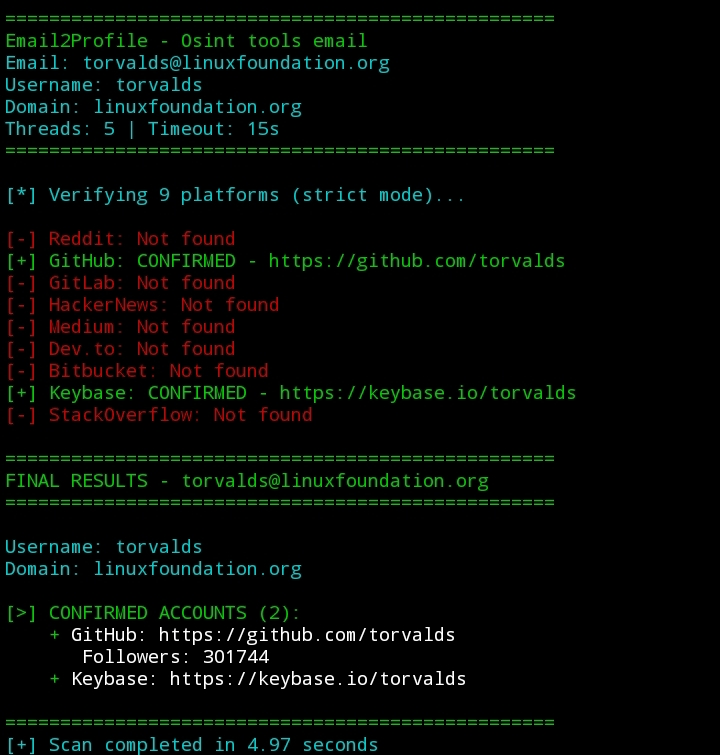

# Email2Profile - Email to Platform Mapper

Professional OSINT tool untuk mapping email ke berbagai platform sosial media dan developer platforms. Dirancang untuk bug hunter, security researcher, dan investigator.

## Fitur

Mapping ke 10 platform: GitHub, GitLab, Bitbucket, Reddit, HackerNews, Keybase, Medium, Dev.to, StackOverflow, Gravatar

Verifikasi akun dengan multiple validation untuk minim false positive

Deteksi akun suspended atau banned

Pengecekan data breach via HaveIBeenPwned API

Gravatar profile lookup

Multi-threading untuk kecepatan maksimal

Export hasil ke format JSON

Support rate limit handling

Timeout configurable untuk koneksi lambat

## Instalasi

git clone https://github.com/nandaanomi/email2profile.git

cd email2profile

pip install requests colorama

## Penggunaan Dasar

python email2profile.py -e target@example.com

## Parameter

-e atau --email : Target email address (wajib)

-t atau --threads : Jumlah threads, default 5

-to atau --timeout : Timeout dalam detik, default 15

-o atau --output : Nama file output JSON

## Contoh Penggunaan

Scan dasar : python email2profile.py -e john.doe@gmail.com

Scan dengan 10 threads : python email2profile.py -e john.doe@gmail.com -t 10

Timeout 30 detik : python email2profile.py -e john.doe@gmail.com -to 30

Simpan ke file : python email2profile.py -e john.doe@gmail.com -o hasil.json

Scan dengan semua parameter : python email2profile.py -e john.doe@gmail.com -t 8 -to 20 -o report.json

 Contoh Output

Username: john.doe
Domain: gmail.com

[>] CONFIRMED ACCOUNTS (3):
    + GitHub: https://github.com/johndoe
    + Reddit: https://reddit.com/user/johndoe
    + StackOverflow: https://stackoverflow.com/users/12345/johndoe

[!] Found in 2 data breaches:
    - LinkedIn (2021-06-22)
    - Adobe (2013-10-04)

==================================================
Scan completed in 8.34 seconds
Results saved to: john.doe_20240115_143022.json

## Notes

Tools ini hanya membaca data publik, tidak melakukan login atau perubahan apapun

Hasil hanya menampilkan akun yang terverifikasi (minim false positive)

Beberapa platform mungkin memiliki rate limit, gunakan threads yang lebih kecil jika sering kena limit

Pastikan koneksi internet stabil untuk hasil terbaik

## Requirements

Python 3.6 atau lebih baru

Library requests

Library colorama (opsional, untuk warna output)

## License

MIT License

## Disclaimer

Tools ini hanya untuk tujuan edukasi dan pengujian keamanan. Jangan gunakan untuk kegiatan ilegal. Bertanggung jawablah atas penggunaan tools ini.
